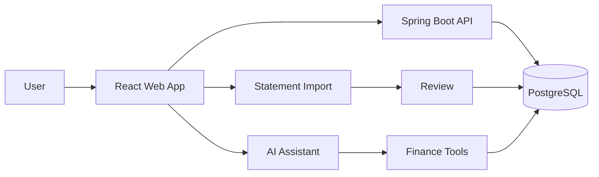

# Personal Finance Intelligence App — PRD

## Product
A personal finance web app for manual expense tracking, bank/credit-card PDF statement import, deterministic analytics, budgets, savings goals, recurring-expense detection, and grounded AI assistance.

## Problem
Users often cannot quickly answer where their money went, which categories/merchants consume the most, what recurring payments exist, or why spending changed.

## Goals
- Fast manual expense capture.
- Reliable monthly financial analytics.
- Safe statement import with review before posting.
- Duplicate, transfer, refund and recurring detection.
- AI categorization and explanations grounded in verified data.
- Core functionality works without AI.

## Non-Goals for V1
Direct bank APIs, investments, tax filing, lending and credit scoring, autonomous financial transactions, and foreign-exchange conversion between currencies.

## Core Features
Authentication, accounts, transactions, categories, merchants, statement processing, review/import, analytics, recurring expenses, budgets, goals, AI categorization, AI assistant, AI insights, search/filter/export, privacy/security.

## Product Principles
1. Canonical confirmed transactions are the source of truth.
2. Transfers are not expenses.
3. Credit-card bill payments must not double-count card purchases.
4. Parsed statements enter staging before canonical import.
5. Financial arithmetic is deterministic and defined in one place: `02-architecture/analytics-specification.md`.
6. AI uses allowlisted backend tools, not arbitrary SQL, and never supplies the user identity a tool reads.
7. Transaction types name their ledger side explicitly, so no figure depends on inferring direction.
8. Tenant isolation is enforced by the database, not by developer discipline.

## Success Criteria
Manual entry is quick; imports are reviewable; analytics reconcile to confirmed transactions; AI never invents source figures; core tracking remains usable when AI is unavailable.
