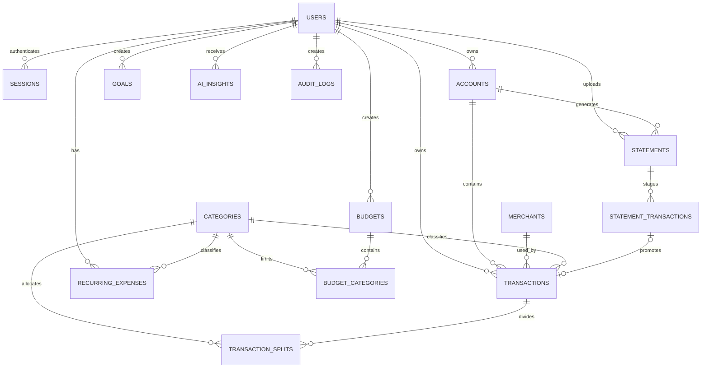

# Database Design

## ER Model


A staged row that is never imported references no canonical transaction, so the relationship is optional on both sides.

## Tables

### users
`id UUID PK`, `email UNIQUE`, `password_hash`, `full_name`, `default_currency`, `timezone`, timestamps, `deleted_at`.

### sessions
`id UUID PK`, `user_id FK`, `token_hash`, `created_at`, `last_seen_at`, `expires_at`, `user_agent`, `revoked_at`.

The session token is stored hashed, so a database disclosure does not yield usable sessions. See ADR-009.

### password_reset_tokens
`id UUID PK`, `user_id FK`, `token_hash`, `expires_at`, `used_at`, `created_at`.

Single-use, short expiry.

### accounts
`id`, `user_id`, `name`, `account_type`, `institution_name`, `last4`, `currency`, `active`, timestamps.

Account types: `BANK`, `CREDIT_CARD`, `CASH`, `WALLET`, `OTHER`.

### merchants
`id`, `user_id`, `canonical_name`, `normalized_key`, timestamps.

### categories
`id`, nullable `user_id` for system categories, `parent_id`, `name`, `category_type`, `is_system`, `is_active`, timestamps.

**Default system categories (ADR-015).** Flat for V1; `parent_id` is left null on every seed row. `category_type` is `EXPENSE` or `INCOME`.

| Category | Type |
|---|---|
| Food & Dining | EXPENSE |
| Groceries | EXPENSE |
| Transportation | EXPENSE |
| Shopping | EXPENSE |
| Bills & Utilities | EXPENSE |
| Rent/Housing | EXPENSE |
| Entertainment | EXPENSE |
| Health & Fitness | EXPENSE |
| Travel | EXPENSE |
| Education | EXPENSE |
| Personal Care | EXPENSE |
| Subscriptions | EXPENSE |
| Insurance | EXPENSE |
| Fees & Charges | EXPENSE |
| Salary | INCOME |
| Interest | INCOME |
| Refunds | INCOME |
| Other Income | INCOME |

18 seed rows, not 19: **"Uncategorized" is not a categories row.** Per `analytics-specification.md`, it is the analytics layer's display label for a transaction whose `category_id IS NULL` - "no category" means exactly that, not a category named "Uncategorized" a user could select or unselect. Giving it a real row would also have no valid `category_type` (it isn't inherently income or expense), which is why the category-type CHECK constraint only allows `EXPENSE`/`INCOME`.

`Fees & Charges`, `Interest` and `Refunds` map to the `FEE_CHARGED`/`INTEREST_CHARGED`/`INTEREST_EARNED`/`REFUND` transaction types so manual entry and AI categorization share one vocabulary.

### transactions
`id`, `user_id`, `account_id`, optional `merchant_id` and `category_id`, `transaction_date DATE`, `amount NUMERIC(19,4)`, `currency`, `description`, `raw_description`, `transaction_type`, `payment_method`, `source`, `source_reference`, `external_transaction_id`, `transfer_group_id`, `confidence_score`, `status`, timestamps.

Types: `EXPENSE`, `INCOME`, `REFUND`, `FEE_CHARGED`, `INTEREST_CHARGED`, `INTEREST_EARNED`, `TRANSFER_OUT`, `TRANSFER_IN`, `CARD_PAYMENT_OUT`, `CARD_PAYMENT_IN`, `CASH_WITHDRAWAL`, `UNKNOWN`. See ADR-012 and `analytics-specification.md` for the ledger-side mapping.

Sources: `MANUAL`, `STATEMENT`, `IMPORT`, `SYSTEM`. Status: `PENDING`, `CONFIRMED`, `IGNORED`, `DELETED`.

`transfer_group_id` links the two halves of a transfer or card payment. `transaction_date` is a calendar date with no timezone component.

### transaction_splits
`id`, `user_id`, `transaction_id`, `category_id`, `amount NUMERIC(19,4)`, `created_at`.

Present from the first migration; the editing UI is deferred (ADR-013). The invariant that splits sum to the parent amount is enforced in the service layer.

### statements
`id`, `user_id`, `account_id`, `file_name`, `storage_key`, `file_hash`, `file_type`, `period_start`, `period_end`, `status`, `error_message`, `created_at`, `processed_at`.

`file_hash` provides upload-level idempotency.

### statement_transactions
`id`, `user_id`, `statement_id`, parsed date/amount/currency, raw and parsed description, suggested type/category/merchant, `confidence_score`, `duplicate_status`, `review_status`, `canonical_transaction_id`, `source_row_reference`, `created_at`.

### recurring_expenses
`id`, `user_id`, `merchant_id`, `category_id`, `name`, `average_amount`, `frequency`, `next_expected_date`, `monthly_estimate`, `yearly_estimate`, `confidence_score`, `is_active`, timestamps.

### budgets
`id`, `user_id`, `name`, `period_type`, `start_date`, `end_date`, `total_limit`, `currency`, `is_active`, timestamps.

### budget_categories
`id`, `user_id`, `budget_id`, `category_id`, `limit_amount`. `UNIQUE(budget_id, category_id)`.

### goals
`id`, `user_id`, `name`, `target_amount`, `current_amount`, `target_date`, `currency`, `status`, timestamps.

### income_sources
`id`, `user_id`, `name`, `source_type`, `expected_amount`, `frequency`, `is_active`, `created_at`.

### ai_insights
`id`, `user_id`, `insight_type`, `title`, `content`, period dates, `supporting_data JSONB`, `model_name`, `prompt_version`, `created_at`.

### audit_logs
`id`, `user_id`, `action`, `entity_type`, `entity_id`, `metadata JSONB`, `created_at`.

## Denormalized `user_id`

Every user-owned table carries `user_id` directly, including `transaction_splits`, `budget_categories` and `statement_transactions`, which reach the user only through a parent. This exists for Row-Level Security: policies that resolve ownership through a subquery are slow and easy to get wrong. The redundancy is deliberate and enforced by foreign key plus a service-layer assertion that the child's `user_id` matches its parent's.

## Row-Level Security

```sql
ALTER TABLE transactions ENABLE ROW LEVEL SECURITY;
ALTER TABLE transactions FORCE ROW LEVEL SECURITY;
CREATE POLICY tenant ON transactions
  USING (user_id = current_setting('app.current_user_id', true)::uuid)
  WITH CHECK (user_id = current_setting('app.current_user_id', true)::uuid);
```

`FORCE` is required. Without it the owning role — which is the application role — bypasses every policy. So does a role with the `BYPASSRLS` attribute, `FORCE` or not: the runtime application role must not have it, even though a convenient default role (e.g. a managed Postgres provider's default owner role) may. Migrations run under a separate, privileged role that does have `BYPASSRLS`; the runtime role does not. Getting this backwards — granting the request-serving connection `BYPASSRLS` — makes every policy below silently inert for real traffic while looking fully configured.

`categories` carries the exception for shared system rows, split by command rather than one blanket policy: a single `USING (is_system OR user_id = ...)` protects `SELECT` correctly but is a real gap on `UPDATE`/`DELETE` — without a narrower `WITH CHECK`, `is_system` alone would let any authenticated user rewrite or delete a shared system row.

```sql
CREATE POLICY categories_select ON categories
  FOR SELECT
  USING (is_system OR user_id = current_setting('app.current_user_id', true)::uuid);

CREATE POLICY categories_insert ON categories
  FOR INSERT
  WITH CHECK (NOT is_system AND user_id = current_setting('app.current_user_id', true)::uuid);

CREATE POLICY categories_update ON categories
  FOR UPDATE
  USING (NOT is_system AND user_id = current_setting('app.current_user_id', true)::uuid)
  WITH CHECK (NOT is_system AND user_id = current_setting('app.current_user_id', true)::uuid);

CREATE POLICY categories_delete ON categories
  FOR DELETE
  USING (NOT is_system AND user_id = current_setting('app.current_user_id', true)::uuid);
```

The current user is set with `SET LOCAL app.current_user_id` **inside the transaction**. Plain `SET` persists on a pooled connection and would serve one user's data to the next request. Migrations run under a role with `BYPASSRLS`; the runtime application role must explicitly not have it (`NOBYPASSRLS`), granted table privileges directly instead — see ADR-010 and `DECISIONS.md`.

## Category Allocation View

All category aggregation reads this view, never `transactions.category_id` directly.

```sql
CREATE VIEW transaction_category_allocations AS
SELECT t.id AS transaction_id, t.user_id, t.category_id, t.amount, t.transaction_date,
       t.currency, t.transaction_type, t.status
FROM transactions t
WHERE NOT EXISTS (SELECT 1 FROM transaction_splits s WHERE s.transaction_id = t.id)
UNION ALL
SELECT s.transaction_id, s.user_id, s.category_id, s.amount, t.transaction_date,
       t.currency, t.transaction_type, t.status
FROM transaction_splits s
JOIN transactions t ON t.id = s.transaction_id;
```

## Financial Rules
- Store amount as a positive magnitude; the transaction type supplies the ledger side.
- Transfers and card payments are two rows sharing a `transfer_group_id`, and contribute nothing to income or expenses.
- Cash withdrawals are not expenses.
- Only `CONFIRMED` transactions enter analytics.
- Statement rows remain in staging until approved.
- Deletion is soft: `status` becomes `DELETED` and the row is retained.
- Duplicate detection uses account, date, amount, source reference and merchant similarity.

## Indexes
Prioritize `(user_id, transaction_date DESC)`, `(account_id, transaction_date DESC)`, `(category_id, transaction_date DESC)`, `(merchant_id, transaction_date DESC)`, `(user_id, transaction_type)`, `transfer_group_id`, `transaction_splits(transaction_id)`, `statement_transactions(statement_id)`, `statements(user_id, created_at DESC)`, `recurring_expenses(user_id, is_active)`, `sessions(token_hash)` and `sessions(user_id)`.

## Migration Order
V1 users, V2 sessions, V3 password_reset_tokens, V4 accounts, V5 categories, V6 merchants, V7 transactions, V8 transaction_splits, V9 statements, V10 statement_transactions, V11 recurring_expenses, V12 budgets, V13 budget_categories, V14 goals, V15 income_sources, V16 ai_insights, V17 audit_logs, V18 allocation view, V19 RLS policies, V20 indexes and constraints.

Migrations are additive-only; see `08-devops/deployment.md`.
