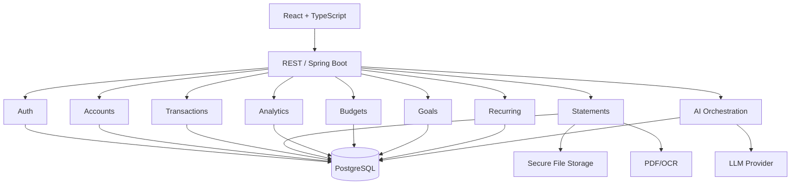

# High-Level Design

## Architecture
Use a modular monolith for V1. Keep module boundaries explicit so services can be extracted later if justified.

## Modules
AUTH, USER, ACCOUNT, TRANSACTION, CATEGORY, MERCHANT, STATEMENT, ANALYTICS, RECURRING, BUDGET, GOAL, AI, INSIGHT.

## Reliability
AI is optional. Core transactions and analytics remain operational without an LLM.

## Async Jobs
Use background jobs for large PDFs, OCR, recurring detection and insight generation.

## Security
HTTPS, adaptive password hashing, cookie sessions with server-side revocation (ADR-009), tenant isolation enforced by PostgreSQL Row-Level Security in addition to application scoping (ADR-010), private statement storage, secret management, data minimization, AI cost caps, and no arbitrary LLM SQL.

## Deployment
V1 production is a single node running Docker Compose behind Caddy, identical in shape to local development. Multiple backend instances, a load balancer and managed PostgreSQL are a later step taken only when a single node is genuinely insufficient. See `08-devops/deployment.md`.

## Analytics Boundary
Every financial figure originates in the ANALYTICS module per `analytics-specification.md`. No other module — and no AI component — computes, adjusts or rounds a displayed number.
