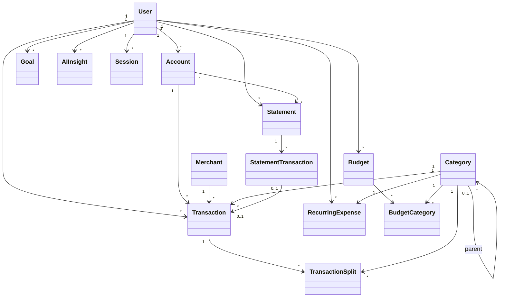

# Low-Level Design

## Package Structure
```text
com.finance
├── auth
├── user
├── account
├── transaction
├── category
├── merchant
├── statement
├── analytics
├── recurring
├── budget
├── goal
├── insight
├── ai/{controller,service,tool,prompt}
├── common
└── infrastructure/{pdf,ocr,ai,storage}
```

## Domain Relationships


## Layering
Controller → Application Service → Domain Service → Repository/External Port.

## Interfaces
```java
interface StatementParser { ParsedStatement parse(FileReference file); }
interface TransactionCategorizer { CategorySuggestion categorize(TransactionCandidate tx); }
interface FinanceTool { String name(); ToolResult execute(ToolInput input); }
interface AIModelClient { StructuredAIResponse generateStructured(AIPrompt prompt); }
interface SessionStore { Session create(UUID userId); Optional<Session> resolve(String token); void revoke(UUID sessionId); }
interface TenantContext { UUID currentUserId(); }
```

## Tenant Context Plumbing
A `TransactionSynchronization` (or equivalent AOP advice) issues `SET LOCAL app.current_user_id` at the start of every transaction, sourced from the authenticated session. `SET LOCAL` is mandatory: a plain `SET` persists on the pooled connection and would leak identity into the next request. Requests with no authenticated user run with no setting, and Row-Level Security correctly returns nothing.

## AI Egress Chokepoint
`AIModelClient` is the only path to an external model provider. It owns redaction, prompt versioning, timeouts, retries, and quota enforcement. No other class may call a provider SDK directly.

## Rules
Controllers handle transport only; services orchestrate use cases; repositories handle persistence; DTOs protect entities; domain validation remains deterministic.
