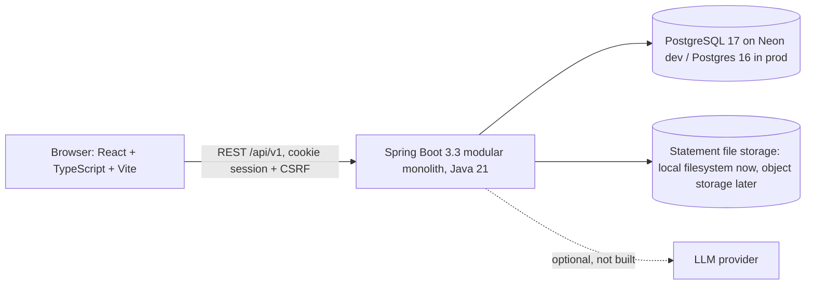
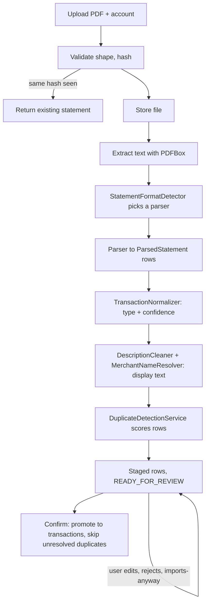

# System Design (as built)

This describes Spendwise as it exists today on the `staging` branch. The aspirational design lives in `hld.md`, `lld.md` and `architecture-decisions.md`; where this file differs, this file is the current truth and the difference is called out under [Known gaps](#known-gaps).

## 1. Goals
- Personal finance tracker for one person's real accounts (Paytm wallet, Bank of Baroda, Ujjivan, Axis) that turns bank PDF statements into clean, deduplicated transactions.
- Correctness of money over everything else: amounts are fixed-precision, every figure comes from one analytics module, and a statement is never imported without review.
- Multi-tenant from day one: one user can never see another user's rows, enforced in the database, not just in application code.
- No paid services during development; AI is optional and replaceable.

## 2. Architecture



A single deployable backend (modular monolith) with explicit module boundaries; the frontend is a separate static build.

### Backend layering (hexagonal)
```
domain/          pure business model and ports (no framework): Statement, StatementTransaction,
                 Transaction, DuplicateScorer, repository interfaces
application/     use-case services (interface + Impl, every one): StatementService, AccountService,
                 TransactionService, DuplicateDetectionService, AnalyticsService ...
infrastructure/  adapters: persistence (JPA entities + mappers), web (controllers, DTOs, CSRF, CORS),
                 security (sessions), pdf (parsers, cleaners), storage, tenancy, idempotency, mail
```
Rules that hold across the codebase: controllers and services depend on interfaces, never on concrete classes (SOLID); domain code has no Spring or JPA imports; JPA entities never leave the persistence package.

### Modules
Auth, Users, Accounts, Categories, Merchants, Transactions (+ splits, transfers), Analytics, Statements (import pipeline). Budgets, goals, recurring detection and the AI modules are specified but not built.

## 3. Request lifecycle and security
1. `GET` establishes a CSRF token: set as a cookie and echoed in an `X-CSRF-Token` response header (a split-origin frontend cannot read another origin's cookie, so it caches the header value).
2. Mutating requests must send the token back in `X-CSRF-Token`; the filter compares it to the cookie (double-submit, ADR-009).
3. `SessionAuthenticationFilter` resolves the opaque session cookie against the server-side `sessions` table (revocable), and sets the tenant context.
4. `TenantContextAspect` runs on every `@Transactional` service method and executes `SET LOCAL app.current_user_id`.
5. PostgreSQL Row-Level Security (enabled and forced on every user table) filters every query by that setting. The runtime database role has no `BYPASSRLS`; migrations run as a separate privileged role.

Consequences worth remembering: a service method without `@Transactional` sees zero rows (the setting is never applied); policies use `NULLIF(current_setting(..., true), '')::uuid` so a reused pooled connection fails closed instead of erroring; cross-tenant lookups return 404, not 403.

Other controls: password hashing, session revocation, idempotency keys on money-moving POSTs (`Idempotency-Key`), upload validation (size, MIME, PDF signature, page limit, encrypted-file rejection), CORS off unless an allowed origin is configured, cookie `Secure`/`SameSite` configurable per environment.

## 4. Data model (core tables)
`users`, `sessions`, `password_reset_tokens`, `accounts`, `categories` (18 system rows + custom), `merchants`, `transactions` (+ `transaction_splits`, view `transaction_category_allocations`), `idempotency_keys`, `statements`, `statement_transactions`.

- Money is `NUMERIC(19,4)`; `amount` is always a positive magnitude and `transaction_type` carries the ledger side (ADR-012).
- Dates are calendar dates, never instants.
- `user_id` is denormalised onto child tables so RLS policies are a single column compare.
- Soft delete / deactivate, never hard delete, for financial records.
- Migrations are Flyway `V1`..`V14`, additive; `ddl-auto=validate` in every profile.

## 5. Statement import pipeline



State machine: `UPLOADED -> PROCESSING -> READY_FOR_REVIEW -> IMPORTED`, or `-> FAILED` (retryable). Confirm is idempotent (idempotency key plus state check).

### Parsers
One `StatementParser` per bank, discovered by Spring injection, each deciding `matches(text)` and `parse(text)`. Parsers were written against real files and the lessons are structural:
- Detection must use specific signals. Bare names collide (Paytm text mentions "Bank Of Baroda"; BOB narrations mention "paytm"), so BOB matches on its footer URL plus a real row shape, and Paytm on its section title "Passbook Payments History".
- Real exports are multi-line blocks, not one row per line. Paytm: date/time/description/ref/tag/account/amount state machine. BOB: date line, wrapped narration, `amount balance Cr`, with debit/credit inferred from balance movement.
- Axis, HDFC, SBI and Ujjivan parsers exist but have only been tested on synthetic samples, not real statements.

### Description cleanup
`DescriptionCleaner` (one per bank) strips references, times and bank suffixes from narrations; `MerchantNameResolver` (a free keyword dictionary today) names well-known brands. Only the display description changes; classification uses the raw text and the raw text is always stored.

### Duplicate detection (Phase 7)
`DuplicateScorer` is pure domain logic. Signals, strongest first: exact payment reference with the same amount (checked across all accounts, because a UPI reference is unique and the same payment shows up in both a wallet and its bank statement); same account, same day, same amount, similar description; nearby date with similar description (flag only). Imported transactions are matched one-to-one. Rows are scored when staged, when the review screen opens and again at confirm, so overlapping statements are caught regardless of upload order. A flagged `DUPLICATE` is skipped on confirm unless the user chooses "Import anyway", recorded with a timestamp.

Verified on real data: of 97 Paytm rows, 24 matched the real BOB statement, equal to the count Paytm itself reports for that bank.

## 6. Frontend
React 19 + TypeScript + Vite, plain CSS design tokens, no UI framework. Pages: Dashboard (analytics), Transactions, Accounts, Statements (upload, per-row review/edit, duplicate badges, confirm). The API client reads `VITE_API_BASE_URL` (falls back to the same-origin `/api/v1`), handles multipart uploads and the CSRF header cache.

## 7. Environments and deployment
| Environment | Backend | Database | Frontend |
|---|---|---|---|
| Local dev | `mvn spring-boot:run`, `dev` profile | Neon dev branch | Vite dev server with `/api` proxy |
| Tests | `mvn verify` | H2 for unit tests; scratch Postgres 16 (Docker/Colima) for `*IT` | - |
| Interim live | Render web service (deploys `main`) | Neon | Vercel (production alias follows `main`) |
| V1 production target | Docker Compose behind Caddy on a DigitalOcean droplet (ADR-017) | Postgres | Caddy-served static build |

Branching: all feature work happens on `staging`; `main` is the live deployment and only advances by merging a verified, complete feature. The statement module is not merged yet.

## 8. Testing strategy
- Unit tests for every parser, cleaner, normalizer and the duplicate scorer, using synthetic fixtures only (PDFs generated in-memory with PDFBox). Real statements are never committed.
- Integration tests (`*IT`, real PostgreSQL with the restricted runtime role) cover auth/CSRF, tenant isolation, RLS behaviour and the full upload, review and confirm flow including duplicates.
- Every parser change is also run against the real statement through the actual app, because two of the worst bugs (format-detection collisions, wrapped narrations) only appeared that way.
- Current suite: 71 unit + 32 integration tests.

## 9. Known gaps
- Password-protected PDFs are rejected with a clear message; support was started and parked in a stash.
- No OCR: scanned statements fail cleanly. A cloud OCR API is the intended path, not a local install.
- Ujjivan, Axis, HDFC and SBI parsers are unverified against real statements.
- Staged rows are inserted one by one; a 186-row statement takes about a minute against the remote dev database. Batch inserts are the fix.
- No rate limiting on auth or upload endpoints (planned for the beta-readiness phase).
- Transfer pairing between a user's own accounts is classified by keyword only; the counterpart transaction is not created or linked.
- AI categorisation, merchant learning from user edits, budgets, goals and recurring detection are not built. Google sign-in and email delivery (Resend) are deferred.
- Statement files live on local disk; object storage arrives with the production deployment.
