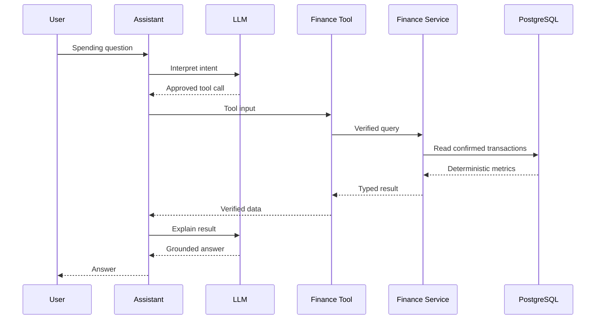

# AI Architecture

AI is an orchestration/explanation layer, not the financial source of truth.

## AI Responsibilities
Intent understanding, categorization suggestions, merchant normalization, explanations and insight generation.

## Backend Responsibilities
Arithmetic, authorization, persistence, transaction state, budgets, duplicate decisions and source-of-truth analytics.

## Failure
If AI is down, manual tracking and deterministic analytics continue.
