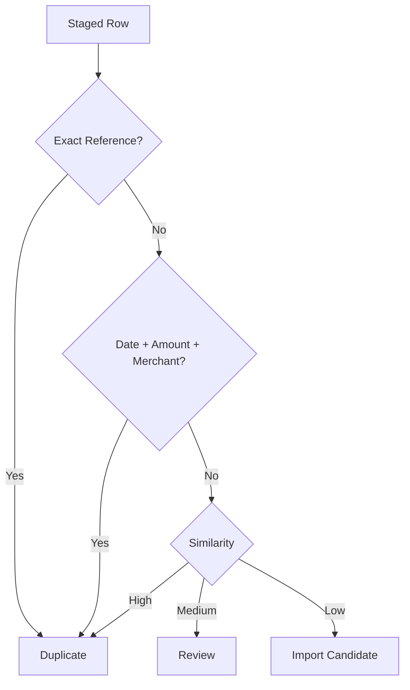

# Duplicate Detection

## Signals
Same account, date, amount, external/reference ID, normalized merchant/description and nearby posting dates.

## Scoring
Exact reference + account is strongest. Date + amount + merchant is high confidence. Nearby-date similarity is medium evidence.

## Overlapping Statements
A September 1–30 upload and September 15–October 15 upload must not duplicate the overlapping canonical events.

## Override
Users can review/override flags where the application permits it, with audit metadata for material overrides.
