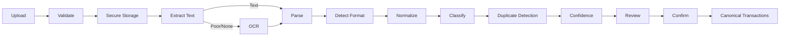

# PDF Statement Processing

## Validation
Check MIME/signature, size, page limits, readability, encryption and malware scanning where available.

## Extraction
Use native text extraction first and OCR fallback for scanned documents.

## Parsing
Support configurable bank/format parsers and debit/credit conventions such as `₹1,200 DR`, `1,200 Debit`, negative values, UPI/POS/NEFT references.

V1 ships parsers for HDFC Bank, SBI and Axis Bank only (ADR-014). An unrecognized format returns `UNSUPPORTED_FILE` rather than attempting a best-effort parse. Additional formats are added post-MVP as real dogfood statements (Phase 8) prove out the format-detection approach.

## State Machine
`UPLOADED → PROCESSING → READY_FOR_REVIEW → IMPORTED`
Failure: `PROCESSING → FAILED`

Low-confidence rows are never silently imported.
