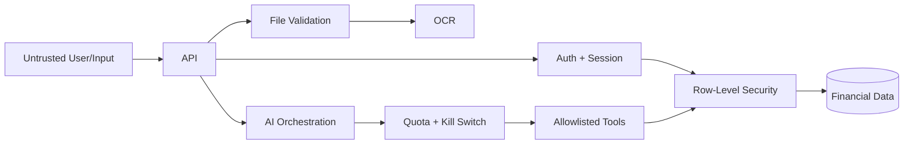

# Security Design

## Authentication
Adaptive password hashing. Server-side sessions in an `httpOnly; Secure; SameSite=Lax` cookie, stored hashed (ADR-009). Rate-limited login, registration and password reset. Session revocation, individually and in bulk. Optional MFA post-MVP.

## Authorization
Every data query is scoped to the authenticated user in the application layer, and enforced independently by PostgreSQL Row-Level Security with `FORCE ROW LEVEL SECURITY` (ADR-010). Identifiers supplied by the frontend are never trusted as proof of ownership. Cross-tenant access returns 404, not 403, so identifiers are not confirmed to exist.

The current user is set with `SET LOCAL` inside the transaction. Plain `SET` persists across pooled connections and would serve one user's data to the next request; a dedicated test asserts this does not happen.

## Data
TLS in transit. Encryption at rest where the platform supports it. Secrets in environment configuration, never in source control. Private object storage for statements with authorized access only. Minimal retention.

## AI
Treat all transaction text as untrusted input. Allowlisted tools only, with arguments validated and user identity taken from the session rather than from model output. No arbitrary SQL. Redact unnecessary PII before any external call. Per-user and global cost caps enforced before dispatch, with a kill switch that disables AI without a deploy.

## Files
Validate MIME type, file signature, size and page count. Scan where available. Private storage, authorized access, and a defined retention policy (D-06, D-07).

## Rate Limiting
Applied to authentication, statement upload and all AI endpoints. Upload and AI endpoints are the expensive surfaces and are limited per user as well as globally.

## Logging
Never log passwords, tokens, session identifiers, API keys or complete statement contents. Structured logs with request identifiers.

