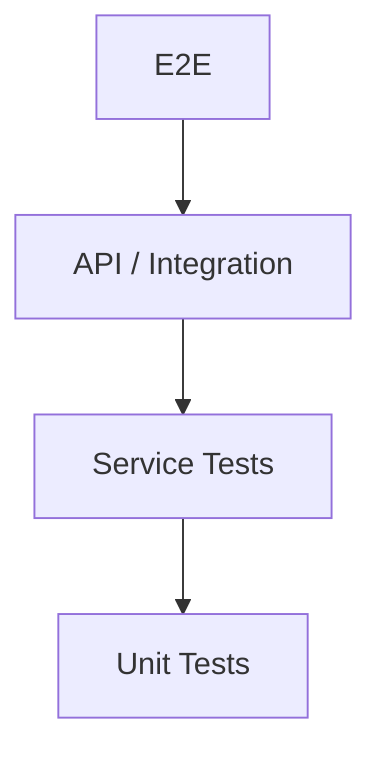

# Testing Strategy

Coverage is deliberately inverted from intuition. Deterministic arithmetic gets exhaustive testing because a wrong figure destroys trust permanently. AI categorization is expected to be wrong sometimes — that is what the review queue exists for — so it gets contract and grounding tests rather than accuracy thresholds.

## Unit
Validation, normalization, duplicate scoring, transfer pairing and every financial calculation in `analytics-specification.md`.

## Service
Transactions, statement import, budgets, recurring detection, session lifecycle and authorization.

## Integration / API
PostgreSQL constraints and queries, status codes, authentication, idempotency, and cross-user isolation.

## PDF
Fixtures for text, scanned, malformed, encrypted and multi-page statements, and for varied debit/credit conventions. Fixtures are synthetic or hand-redacted; real financial data is never committed.

## AI
Golden dataset, tool selection, numerical grounding, injection resistance and prompt regression. See `04-ai/ai-evaluation.md`.

## E2E
Register, login, logout-everywhere; manual expense; transfer pairing; statement upload, review and confirm; duplicate upload; budget progress; AI question.

## Release Gates

A release is blocked when any of the following fail.

1. **Reconciliation invariants.** All six from `analytics-specification.md`.
2. **The worked example.** The September fixture produces expenses of 2,000 and a savings rate of 97.5.
3. **Cross-tenant isolation matrix.** User A requesting User B's transaction, statement, budget, goal, account and split each returns 404.
4. **Pooled-connection leakage.** Two sequential requests from different users over the same pooled connection never see each other's rows.
5. **Idempotency.** A repeated statement confirm imports nothing twice.
6. **Grounding.** No monetary claim in an AI answer lacks a corresponding tool result.
7. No critical test failures, authorization failures or import bypasses.
