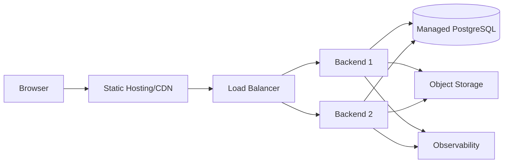

# Deployment

## V1 Production — Single Node

```text
Internet -> Caddy (TLS, reverse proxy)
              |-- /     -> frontend static build
              |-- /api  -> Spring Boot container
                             |-- PostgreSQL container (named volume)
                             |-- S3-compatible object storage (statements)
```

One VPS running Docker Compose. Caddy obtains and renews certificates automatically, removing the most tedious piece of manual operations.

### Sizing

Plan for 4 GB RAM. The JVM wants roughly 768 MB to 1 GB of heap, PostgreSQL around 512 MB, and OCR spikes well above its baseline on a large scanned statement. 2 GB is survivable with tuning, but OCR will eventually trigger the OOM killer at the worst moment. Required settings:

- Explicit JVM `-Xmx`.
- Explicit PostgreSQL `shared_buffers` and `work_mem`.
- OCR runs with both a memory cap and a page limit.

Statements are written to S3-compatible object storage rather than the VPS disk, so the box can be rebuilt without data loss and backups stay simple.

**Provider, size and region (ADR-017).** DigitalOcean droplet, 4 GB RAM / 2 vCPU, Bangalore (BLR1) region. Statement object storage is DigitalOcean Spaces in the same region.

## Backups

- Nightly `pg_dump` to object storage with a 30-day lifecycle expiry.
- A committed `restore-drill.sh` that restores the latest dump into a scratch container and runs row counts plus the reconciliation invariants from `analytics-specification.md`.
- The drill runs monthly. An untested backup is not a backup.
- RPO and RTO targets are **D-10**.

## Deploy Pipeline

```text
push -> lint -> unit tests -> integration tests -> build image
     -> push to registry -> ssh to host -> docker compose pull && up -d -> smoke test
```

Flyway runs migrations on boot. A single instance means no migration locking concerns.

Roughly 30 seconds of downtime per deploy is acceptable at this stage. Zero-downtime deployment is deferred until someone notices.

Image tags are the git SHA, never `latest`, so rollback is redeploying the previous tag.

### Migrations Are Additive-Only

A rolled-back image must still run against the migrated schema. Therefore: add a nullable column, backfill it, switch the code, and drop the old column in a **later** release. Never drop or rename a column in the same release that stops using it. This rule is what makes image rollback actually safe.

## Secrets

Environment file on the host, permissions `600`, never in source control. A dedicated secrets manager is deferred.

## Later — When Traffic Justifies It

The following is the target once a single node is genuinely insufficient. It is not the V1 deployment.



Moving to this shape requires externalizing the session store, which the `sessions` table already supports, and moving PostgreSQL to a managed instance.
